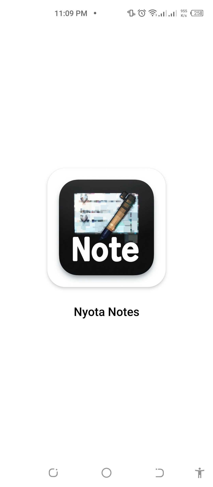
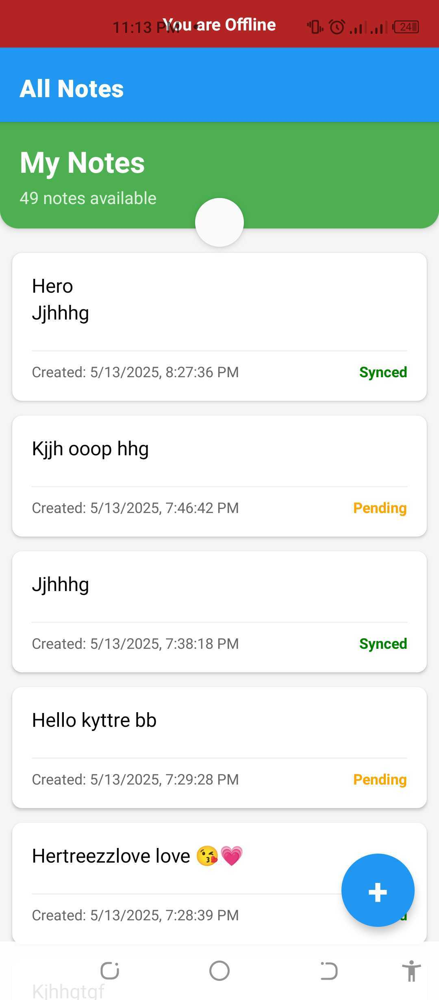
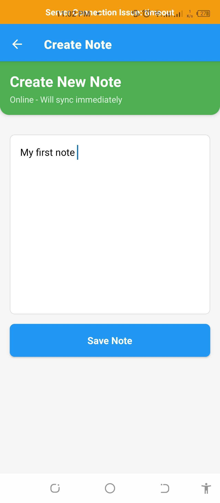
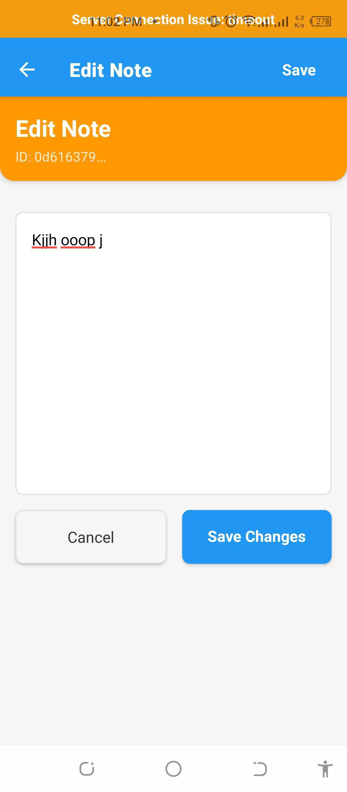
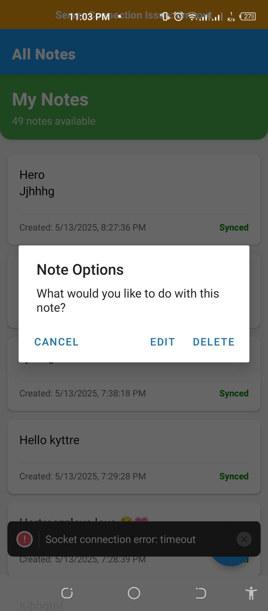

# Nyota Notes

A full-stack offline-first note-taking application with real-time synchronization capabilities. This app allows users to create, edit, and delete notes that sync across devices in real-time when online and automatically sync when connectivity is restored.

## Project Overview

This project consists of two main components:

1. **Mobile App**: A React Native application built with Expo bare that provides a beautiful, responsive interface for note management
2. **Backend Server**: A Node.js/Express.js server with Socket.IO for real-time communication and PostgreSQL for data persistence

## Features

- ✅ **Offline-First Design**: Create, edit, and delete notes without network connectivity
- 🔄 **Real-Time Sync**: Changes automatically synchronize across devices when online
- 🔔 **Push Notifications**: Receive notifications when notes are synced or updated 
- 📝 **Note Management**: Full CRUD functionality for notes
- 🌐 **Network Status Awareness**: App adapts to changing network conditions
- 📱 **Responsive UI**: Beautiful interface designed for mobile devices
- 🔄 **Conflict Resolution**: Version tracking to prevent sync conflicts

## Tech Stack

### Mobile App
- **Framework**: React Native with Expo Bare
- **Navigation**: React Navigation
- **State Management**: React Context API and custom hooks
- **Storage**: AsyncStorage for local persistence
- **Networking**: Socket.IO Client for real-time updates
- **Utilities**: NetInfo for network status detection

### Backend Server
- **Framework**: Node.js with Express.js
- **Real-Time Communication**: Socket.IO
- **Database**: PostgreSQL with Sequelize ORM
- **API**: RESTful endpoints + WebSocket communication

## Getting Started

### Prerequisites
- Node.js 16+
- npm or yarn
- PostgreSQL database
- Expo CLI (`npm install -g expo-cli`)

### Backend Setup

1. Clone the repository:
   ```bash
   git clone https://github.com/yourusername/nyota-project.git
   cd nyota-project/backend
   ```

2. Install dependencies:
   ```bash
   npm install
   ```

3. Set up environment variables:
   Create a `.env` file in the backend directory with:
   ```
   PORT=3000
   DB_HOST=localhost
   DB_USER=postgres
   DB_PASS=your_password
   DB_NAME=nyota_notes
   CORS_ORIGIN=*
   ```

4. Set up the database:
   ```bash
   npm run migrate
   ```

5. Start the server:
   ```bash
   npm run start:dev
   ```

### Mobile App Setup

1. Navigate to the mobile directory:
   ```bash
   cd ../mobile
   ```

2. Install dependencies:
   ```bash
   npm install
   ```

3. Configure API endpoint:
   Edit `src/config/env.js` to point to your backend server address

4. Start the development server:
   ```bash
   npm start
   ```

5. Follow Expo instructions to run on a device or emulator

6. To connect with the Expo Go app on your mobile device:
   - Make sure your mobile device is on the same network as your development machine
   - For Android: Use `exp://<YOUR_LOCAL_IP>:3000` in the Expo Go app
   - For iOS: Scan the QR code from the terminal or Expo Dev Tools

7. Screenshots

<p align="center">
  
  
</p>
<p align="center">
  
  
</p>
<p align="center">
  
</p>

## Project Structure

### Mobile App
```
mobile/
├── assets/              # Static assets and images
├── src/
│   ├── components/      # Reusable UI components
│   ├── config/          # Configuration files
│   ├── contexts/        # React Context providers
│   ├── hooks/           # Custom React hooks
│   ├── notifications/   # Push notification handling
│   ├── screens/         # App screens
│   ├── storage/         # Local storage management
│   ├── utils/           # Utility functions
│   └── App.js           # Main app component
├── app.json             # Expo configuration
└── package.json         # Dependencies and scripts
```

### Backend
```
backend/
├── config/              # Configuration files
├── database/            # Database models and migrations
├── src/
│   ├── controllers/     # Request handlers
│   ├── middleware/      # Express middleware
│   ├── routes/          # API routes
│   ├── sockets/         # Socket.IO handlers
│   ├── app.js           # Express app setup
│   └── server.js        # Server entry point
└── package.json         # Dependencies and scripts
```

## Key Implementation Details

### Offline-First Architecture
The app implements a robust offline-first approach using:
- Local storage for note persistence
- Queue system for pending operations when offline
- Automatic synchronization when connection is restored

### Real-Time Synchronization
- Socket.IO establishes bidirectional communication
- Singleton pattern ensures consistent socket connections
- Event-based synchronization with proper acknowledgments
- Version tracking to resolve conflicts

### UI/UX Considerations
- Responsive card design for notes
- Visual indicators for sync status
- Context menus for note actions (edit/delete)
- Pull-to-refresh functionality
- Optimistic UI updates for instant feedback

## Acknowledgments

- Thanks to the React Native and Socket.IO communities
- Inspired by the need for reliable offline-first applications